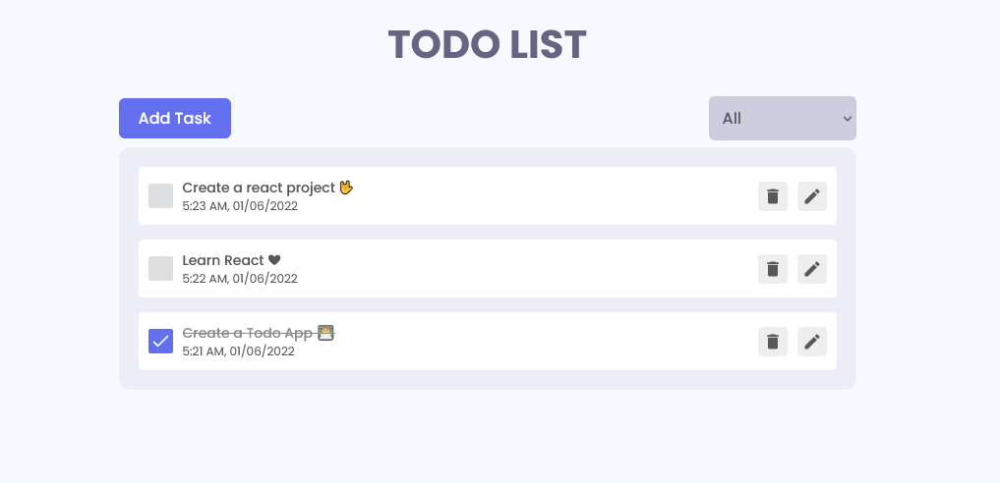
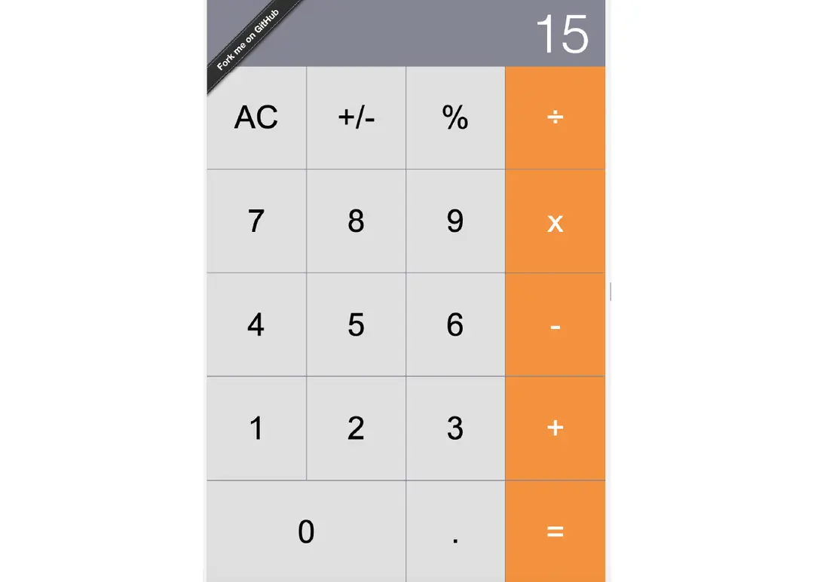
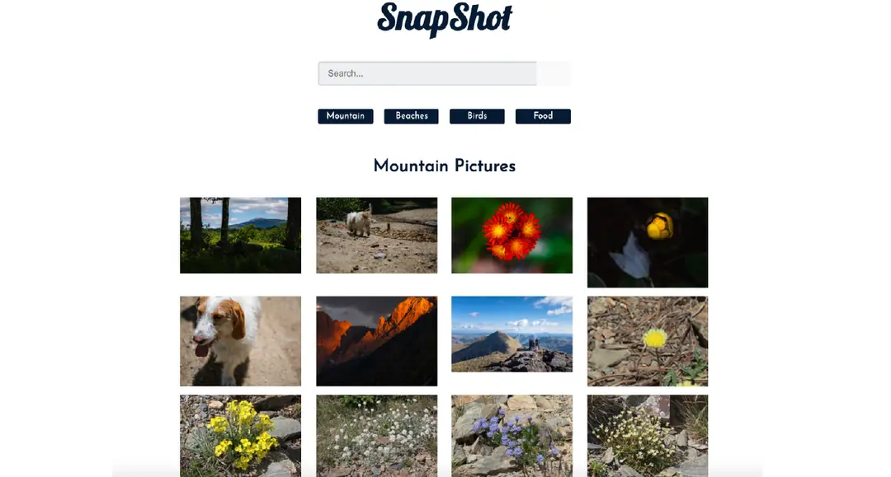
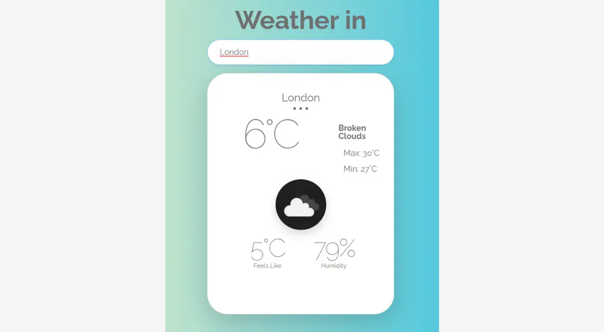
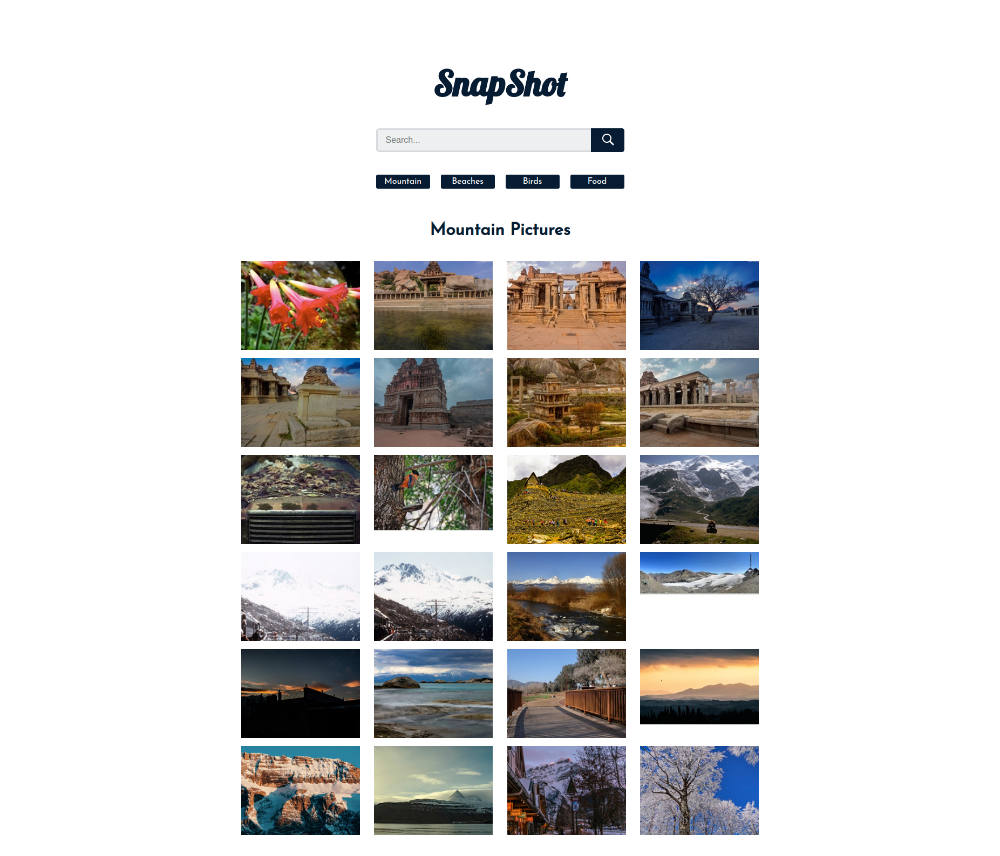
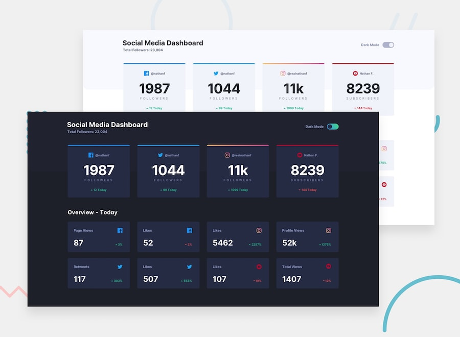

## 1. To Do App
A app that keeps track of your to-do actions, you can add any number of tasks to it, search those tasks, click on the checkbox to complete the task, and filter using buttons like active tasks, completed tasks and all the tasks. This is another great project for you to add to your portfolio as a beginner React developer. 

## 2. Calculator
A simple to use calculator with an appealing user interface. A virtual calculator built with React is another good project idea for you to try as a beginner. 

We have seen various calculator apps on our mobile phones, computers and different devices as well. Here we have an input box which takes user input as numbers and then try to do operations like addition, subtraction, division and multiplication etc. Here we will learn to create a web app with all the features of the calculator on UI. 

## 3. Snapshot

It’s a simple gallery react project where we can search the photos by keywords, change the category based on given options as Mountain, Beaches, Birds, Food. Once you hover on the images, you will get the zoom-in images. 

This react project has been developed using React Hooks, Context API and React Router. The Routes were set up for four default pages and a search page. Also, the images were displayed using the Flickr API and Axios to fetch data as given in the description of repository. 

## 4. Weather App

A weather application that provides detailed weather details for a location specified by the user. Built using React and Open Weather API for showing latest weather data. Here we have search options with city and country for which we would like to see weather forecast. We will use the fetch method to fetch the API calls along with the React hooks and conditional rendering.

## 5. Recipe Finder Web Application

Recipe Finder is a recipe web application, where a user can search for a variety of recipes and find the ingredients and quantities needed to make each recipe item. Also, favorite recipe items can be saved in the browser's local storage. It is easy to find different recipes for vegetarians and meat eaters, as well as those who want to lose weight.

You're one-stop for recipes, It is the best app for any type of cooking and cooking level. Browse what's trending, plan your meals with our grocery list tool, and browse recipes by ingredient. There's nothing like a well-prepared meal to make you feel like a culinary genius!

### Features
 - Users can search different kinds of recipes and get the ingredients for these
 - Users can save specific recipes as the favorites
 - Favorite recipes are also stored in the local storage of the client's browser
 - It is a fully responsive web application, so you can easily view it on your 
 - mobile device as well.

### 6. Snap Shot
Snap Shot is a gallery created using React,React Hooks, React Router and Context API. The Routes were setup for four default pages and a search page. Also the images were displayed using the Flickr API and axios to fetch data.

### 7. Social media Tracker with theme switcher

 
 
 ## The challenge

Your challenge is to build out this Social Media Dashboard and get it looking as close to the design as possible.

You can use any tools you like to help you complete the challenge. So if you've got something you'd like to practice, feel free to give it a go.

Your users should be able to:

- View the optimal layout for the site depending on their device's screen size
- See hover states for all interactive elements on the page
- Toggle color theme to their preference

## Where to find everything

Your task is to build out the project to the designs inside the `/design` folder. You will find both a mobile and a desktop version of the design to work to. 

The designs are in JPG static format. This will mean that you'll need to use your best judgment for styles such as `font-size`, `padding` and `margin`. This should help train your eye to perceive differences in spacings and sizes.

You will find all the required assets in the `/images` folder. The assets are already optimized.

There is also a `style-guide.md` file, which contains the information you'll need, such as color palette and fonts.